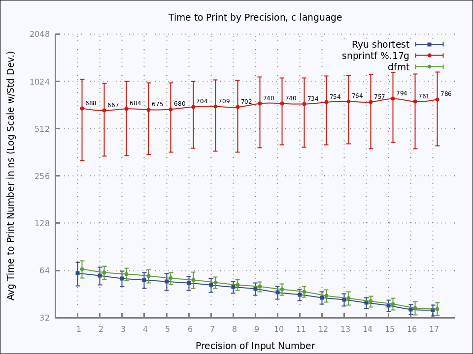
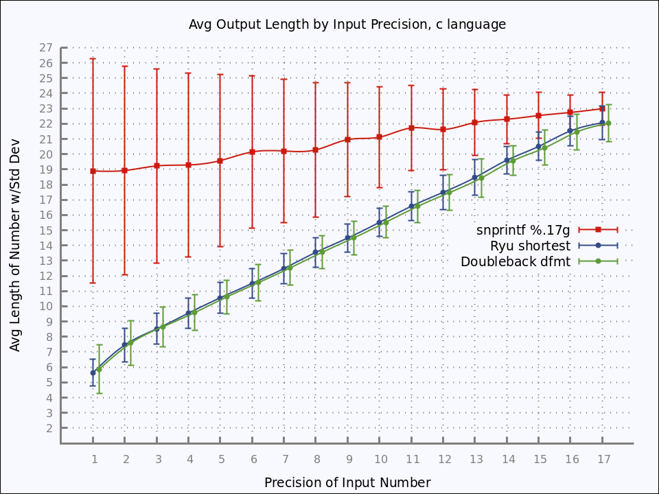

# Table of Contents
* [Doubleback](#doubleback)
* [Status](#status)
* [Roadmap for first release](#roadmap-for-first-release)
* [Getting Started](#getting-started)
* [The Problem with Printing Floating-Point Numbers](#the-problem-with-printing-floating-point-numbers)
* [The Doubleback Rationale](#the-doubleback-rationale)
* [What is printf %g formatting?](#what-is-g)
* [Doubleback/Ryu based %g formatting](#doubleback-g)
* [The Doubleback API](#the-doubleback-api)
* [Benchmarks](#benchmarks)
* [Why not DragonBox or other?](#why-not-dragonbox-or-other)
* [Acknowledgements](#acknowledgements)
* [Charts that show Doubleback/Ryu is Fast with Short Output](#pretty-charts)

# Doubleback

Doubleback provides round-trip parsing and printing of 64-bit double-precision floating-point numbers using the Ryu algorithm implemented in multiple programming languages. Doubleback is biased towards "human-friendly" output which round-trips consistently between binary and decimal.

The Doubleback project unifies code forked from various github projects. See Acknowledgements.

glibc:
```
printf("%.17g", 0.3);
0.29999999999999999
```

Ryu shortest:
```
char buf[32];
d2s_buffered(0.3, buf);
printf("%s", buf);
3E-1
```

Doubleback dfmt - `Ryu shortest` reformatted to be like `printf("%.17g")`:
```
char buf[32];
printf("%s", dfmt(0.3, buf));
0.3
```

Ryu is an algorithm along with reference code developed by Ulf Adams, Google Germany in 2018 [1][2]. Ryu supports consistent round-trip parsing and "shortest" printing of 64-bit floating-point numbers. To be clear, Ryu is the breakthrough technology that makes Doubleback possible.

There are many older and established algorithms for printing floats. However, Ryu is in a new class of recently developed algorithms that claim substantial improvements over previous efforts.

These algorithms:
* Produce a consistent round-trip representation for all 64-bit doubles
* Produce the shortest length string from equivalent choices in all cases
* Execute in a fraction of the time of previous efforts

Doubleback merges forks of existing Ryu projects and modifies and enhances them to expose a consistent API. Doubleback tests APIs against each other for consistency.

Doubleback implements printf %g equivalency which was not implemented previously by the reference Ryu project [3]

1. https://dl.acm.org/doi/10.1145/3296979.3192369
2. https://dl.acm.org/doi/pdf/10.1145/3360595
3. https://github.com/ulfjack/ryu  (There is a wealth of information about Ryu in the README here.)

# Status

Doubleback is in development and is not ready for use or contributions.

# Roadmap for first release

* dfmt tests
* Setup github actions
* Java dfmt

# Getting Started

There are a number of dependencies for building Doubleback. See the [build document](docs/Build.md).

```
$ git clone https://github.com/ironmeld/doubleback
$ cd doubleback
$ make
```

# The Problem with Printing Floating-Point Numbers

A big limitation of binary floating-point numbers is that some base 10 numbers like 0.1 cannot be precisely converted to binary [1]. If the number 0.1 is converted to a 64-bit number then it must be rounded to the nearest binary number. The resulting number in binary form is actually 0.1000000000000000055511151231257827021181583404541015625. [2]

Now, say you want to print that binary number. A 64-bit floating point number requires, at most, 17 digits in base 10 (decimal) to accurately represent the number sufficiently so that it will return the same binary number when parsed back into binary [3]. However, at seventeen digits, the binary number above rounds to 0.10000000000000001. So, technically that is the most accurate decimal representation of the binary number at 17 digits. But the critical point is that, due to the rounding error described in the previous paragraph, 0.1 will round-trip back to 0.1000000000000000055511151231257827021181583404541015625 in binary. This is the exact same binary value that 0.10000000000000001 ends up rounding to when parsed.

So if 0.1 and 0.10000000000000001 both preserve the information necessary to recover the exact same binary number, why not use the shorter one when printing it?  Well, an implementation may decide that the longer representation is preferred because it should try to honor the binary value as accurately as possible. From a mathematical point of view, it seems like the natural and correct thing to do.

It should be clear at this point that there are conflicting requirements. The best strategy for printing a floating-point number likely depends on its origin. Did the number originated from a binary calculation inside the computer or was it was originally entered by a human being using base 10 decimal? If a human entered the number, an equivalent but shorter representation is more likely appropriate. If a scientist wrote code to calcuate the number, it may be that ".10000000000000001" is a more accurate representation of the real number calculated and it would be preferable to leave it that way in case it is later parsed with *higher precision*. (Although it won't parse any differently at 64-bit precision.)

A general printing algorithm does not know from which source the floating-point number originated. Moreover, it is reasonable to expect that determining the shortest representation in decimal that will recover the binary number will take more work than the alternative. In fact, there are some tricky issues that can lead to close-but-not-optimal solutions [4]. It should not be surprising then that many different algorithms have been implemented over the years and implementations continue to evolve as the research into new techniques also evolves.

1. https://www.exploringbinary.com/why-0-point-1-does-not-exist-in-floating-point/
2. https://www.exploringbinary.com/floating-point-converter/
3. https://en.wikipedia.org/wiki/Double-precision_floating-point_format
4. https://www.exploringbinary.com/the-shortest-decimal-string-that-round-trips-may-not-be-the-nearest/

# The Doubleback Rationale

Doubleback is opinionated in a few ways.

The first opinion is that shorter representations of floating-point numbers are preferable over longer, perhaps more accurate representations, if they round-trip back to the exact same 64-bit binary number anyway. As explained in the previous section, there are users who prefer to represent binary values with extreme precision, and care less about poor ergonomics. But those users have other options. For example, they can reduce conversion error by using hexadecimal notation, binary storage, longer floating point types, or arbitrary precision libraries.

There is only so much accuracy one should expect when working with 64-bit binary numbers. Moreover, if you are converting to decimal notation then that is likely for human consumption. So ergonomics seems like a reasonable bias for that operation. Python recognized the pragmatic advantage of shorter representations many years ago [1]. Chasing down some illusory extra bit of precision that will provide hardly any real benefit to all but a small minority of users (who have better options) should not be the priority.

The second opinion is that %.17g has the appropriate semantics for round-trip preservation of human-entered 64-bit floating-point numbers with the appropriate number of significant digits. It should be easy to produce output in this style. Moreover, is should be easy to output like %g but without plus signs or leading zeros on exponents, as that will be even shorter.

The third opinion is that Ryu is the right algorithm at the right time for implementing this solution.

1. https://bugs.python.org/issue1580

# What is printf %g formatting?  <a name="what-is-g"></a>

Let's say you want printf to print a double accurately, with up to 17 significant digits *and* to print only as many digits as necessary for accuracy. The number "0.5" will round-trip perfectly into binary so there is no need to print 17 digits. If those are your requirements, then %.17g is the only printf format that fulfills them. Both %.17e and %.17f will print 17 digits, with zeros if necessary.

Furthermore %g will render without exponents if the number is not too big or too small (while factoring in the requested precision) otherwise it will render with exponents.

Some of the details can be found here:
https://stackoverflow.com/questions/54162152/what-precisely-does-the-g-printf-specifier-mean

There is one more aspect of %g that should be highlighted. The precision number specified in the %g format means *total significant digits* including both whole number digits and fractional digits, while the number means *fractional digits only* for %e and %f.

The specification gives a formula by which %g can be converted to an equivalent %f which is P − (X + 1), where P is requested precision and X is the exponent of the value in scientific notation. The fact that %g precision is interpreted as total significant digits is documented in the printf man page under the description of precision but it is easy to overlook this detail.

This "total significant digits" behavior can truncate some of the fractional digits if the number is large and the requested number of significant digits is not enough, because the significant digits may be used up by the whole number portion. This occurs if the number of significant digits left over after consumption by the whole number are *less than* necessary to accurately print the fractional part. The effect of this is to reduce the length of the string, for better or for worse. It would be bad if it unintentionally loses precision. To avoid that, one uses %.17g to make sure %g never truncates a digit necessary to accurately represent any 64-bit float. We can be sure that truncation is always throwing away useless digits. In the context of "%.17g", I think of this as "truncating digits that would otherwise overstate recoverable precision".

A potential downside of %.17g occurs when the number of significant digits left over for the fractional part are *more than*  necessary to display it accurately and the excess digits just end up as zeros. This brings in the second feature of %g - trailing fractional zeros are removed. Call this "truncating digits that are implied and therefore useless, even though they accurately reflect the recoverable precision".

So %.17g ends up "right-sizing" the precision when displayed without an exponent. It tries to display as many digits as necessary to be precise, but *no more*.

# Doubleback/Ryu based %g formatting  <a name="doubleback-g"></a>

Adams provided implementations for %e, %f, and "shortest". Ryu "shortest" mode is similar to %g, but it is not the same. When first learning about Ryu, one could be forgiven for mixing up Ryu's "shortest" with %g. They both can result in "right sizing" the number of significant digits while supressing trailing zeros.

However, for the number "0.3" Ryu shortest outputs "3E-1" instead of "0.3". Ryu "shortest" always outputs exponential notation, which is different from %g. An explanation for this is found in this issue: https://github.com/ulfjack/ryu/issues/154.

I suspect there was an early intent to provide the equivalent %g functionality, as stated in the paper:
```
This paper describes the Ryu Printf algorithm, which generates printf-identical output
for the %f, %e, and %g formats with arbitrary runtime-provided precision parameters,
i.e., printf("%.<p>f",<f>), printf("%.<p>e",<f>), and printf("%.<p>g",<f>)
for any precision p and floating-point value f.
```

However, there is this statement further down:
```
We do not discuss the %g format in detail as it is merely a combination format:
depending on the provided value, the implementation decides whether to use %f or %e format.
```

Later, Adams demonstrates awareness that %g has additional complexity:

```
For the %g specifier, printf picks either %f or %e formatting, depending on the exponent,
and also omits trailing zeros from the result.
```

As described in the previous section, the implementation of %g is not so trivial as it seems upon first glance.

So additional work is required to implement %g formatting.

# The Doubleback API

The "flagship" API for Doubleback in C notation is:

```
char *dfmt(double value, char *buffer);
```

This output is similar to printf("%.17g") except it is shorter in three ways: it uses Ryu to pick the shortest representation, it never zero-pads the exponent, and it does not print a plus sign for positive exponents.

To avoid memory allocation and threading complications a small memory buffer must be passed to the API. The buffer pointer is returned back for convenience.

# Benchmarks
 
The "ergonomic magic" of "0.3" instead of ".299999999..." is awesome, but at what performance cost compared to printf %g?

The benchmark Adams provided for Ryu "shortest" is against Google's double_conversion (Grisu3). We provide new benchmarks at the bottom of this page for Doubleback/Ryu dfmt vs snprintf %g vs Ryu shortest.

# Why not DragonBox or other?

The performance benefits of DragonBox [1] are compelling [2] and I was close to going all in on DragonBox instead of Ryu. However, at the time of this writing (Mar 13, 2021) DragonBox is around 6 months old and has not been peer reviewed or implemented in any language other than C++. Ryu, on the other hand, has received substantial investment in development and testing. There are implementations at various stages of development for over ten different programming languages. Microsoft developed an implementation and extensive tests for incorporation into libc++ that spans over 60,000 lines of code [3]. There is a similar effort for Go although it appears to have stalled [4].

I think it is likely that an algorithm different from Ryu, perhaps DragonBox, will ultimately be considered the state-of-the-art. That algorithm will likely be functionally equivalent and could be a compelling candidate to replace Ryu in the future. But for now, the next-gen floating-point boat has already departed and Ryu is on it.

1. https://github.com/jk-jeon/dragonbox
2. https://github.com/abolz/Drachennest/
3. https://reviews.llvm.org/D70631
4. https://github.com/golang/go/issues/15672

# Acknowledgements

Doubleback is derived from upstream projects.

| Language | Upstream Project |
|----------|------------------|
| C        | https://github.com/ulfjack/ryu |
| Java     | https://github.com/ulfjack/ryu |


# Charts that show Doubleback/Ryu is Fast with Short Output  <a name="pretty-charts"></a>




